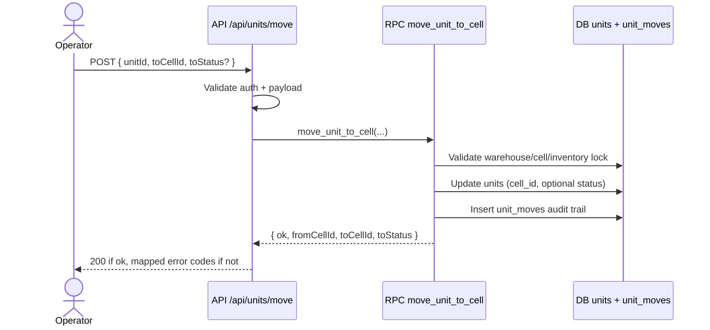
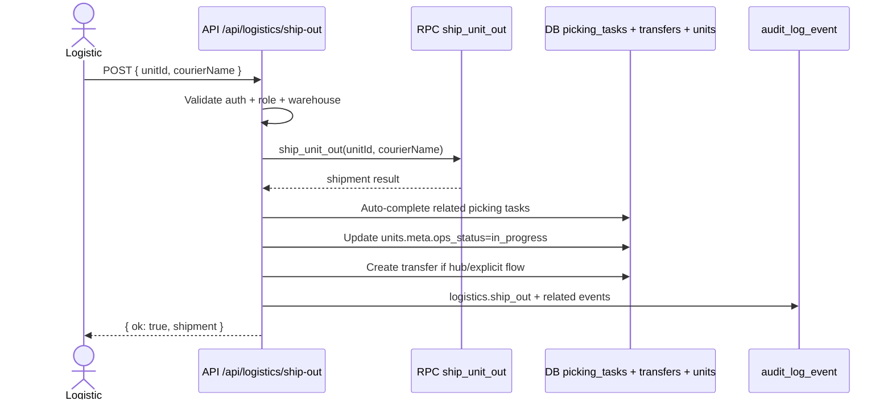
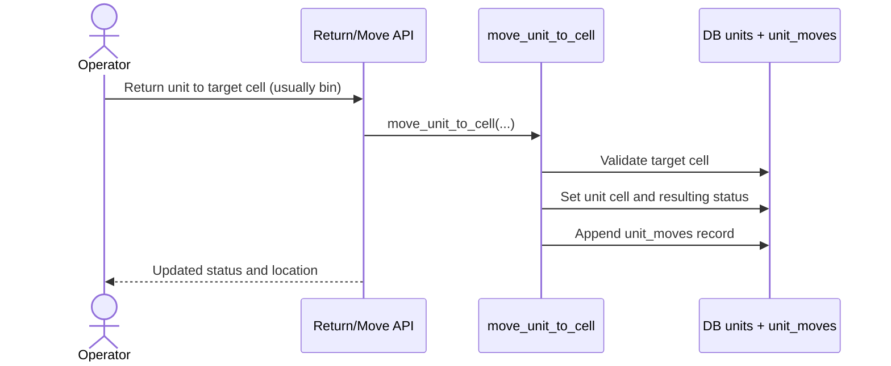
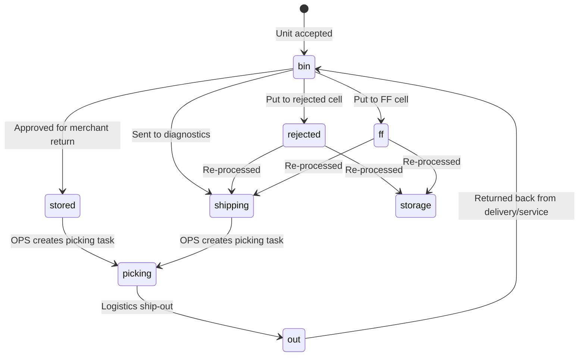
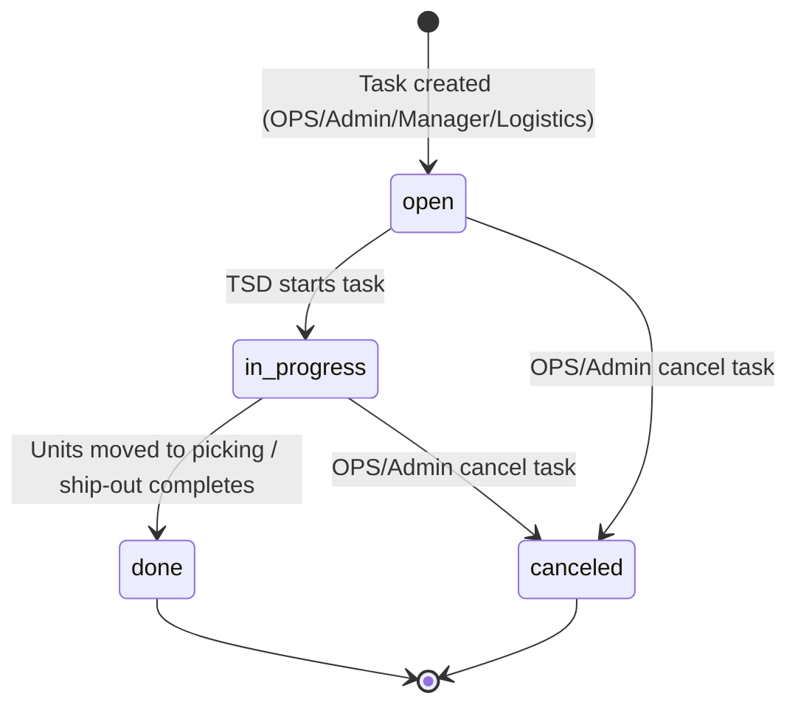

# Warehouse Process Contract

This folder defines the source-of-truth process contract for critical warehouse flows.

## Scope

- Move unit between cells (`/api/units/move`)
- Ship unit out (`/api/logistics/ship-out`)
- Return unit back from out flow

## Related Documents

- `docs/process/invariants.md`
- `docs/process/test-matrix.md`
- `docs/process/pr-checklist.md`
- `docs/process/working-agreement.md`
- `docs/process/quality-report.md`

## How to use

- Treat invariants as non-negotiable business rules.
- Update sequence diagrams when behavior changes.
- Add or update tests for every changed invariant.

## Sequences

### 1) Move Unit (`/api/units/move`)

### 2) Ship Out (`/api/logistics/ship-out`)

### 3) Return Unit From Out

## Status State Diagram

## Picking Task State Diagram

