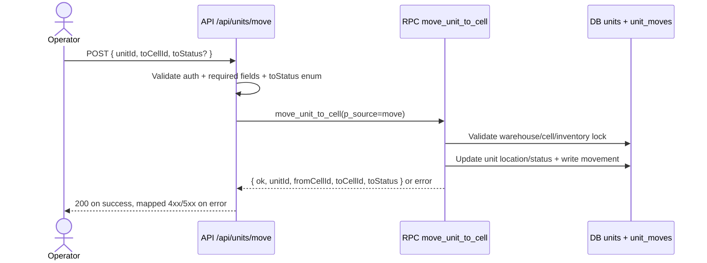
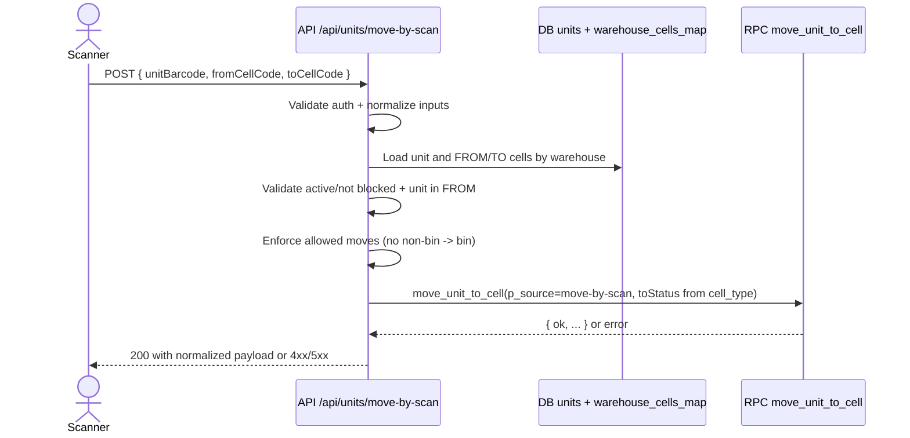
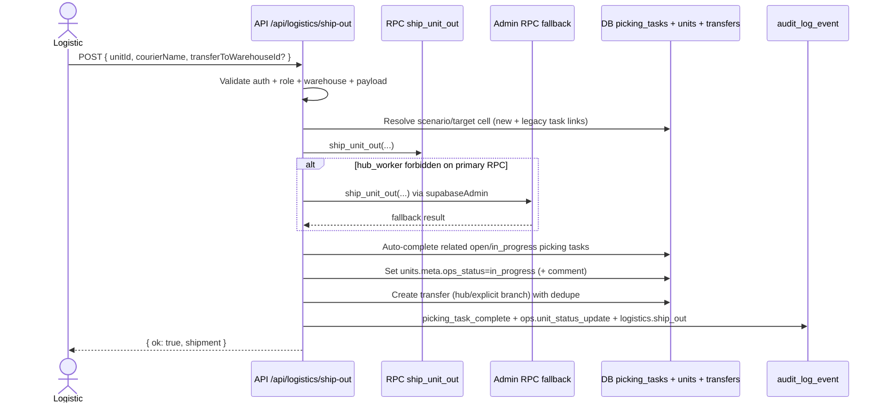
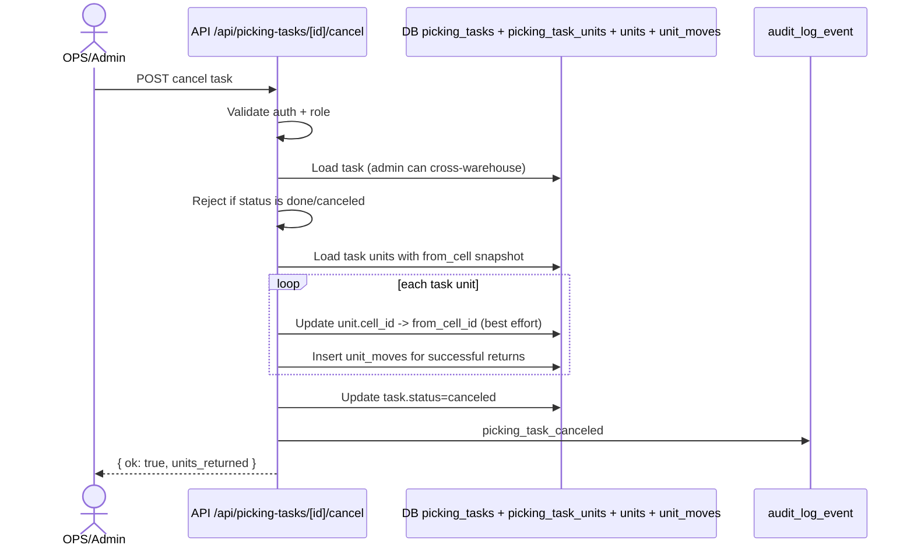
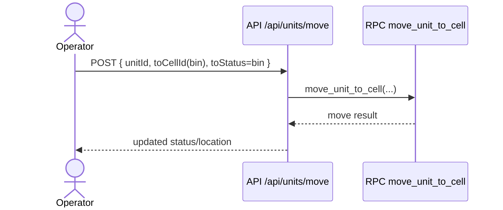
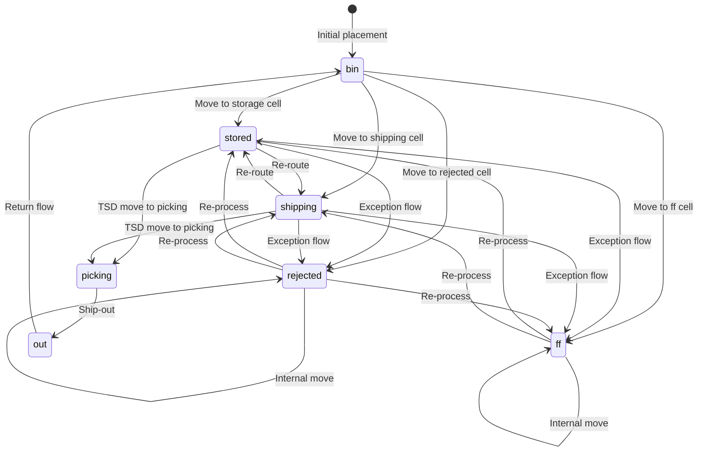
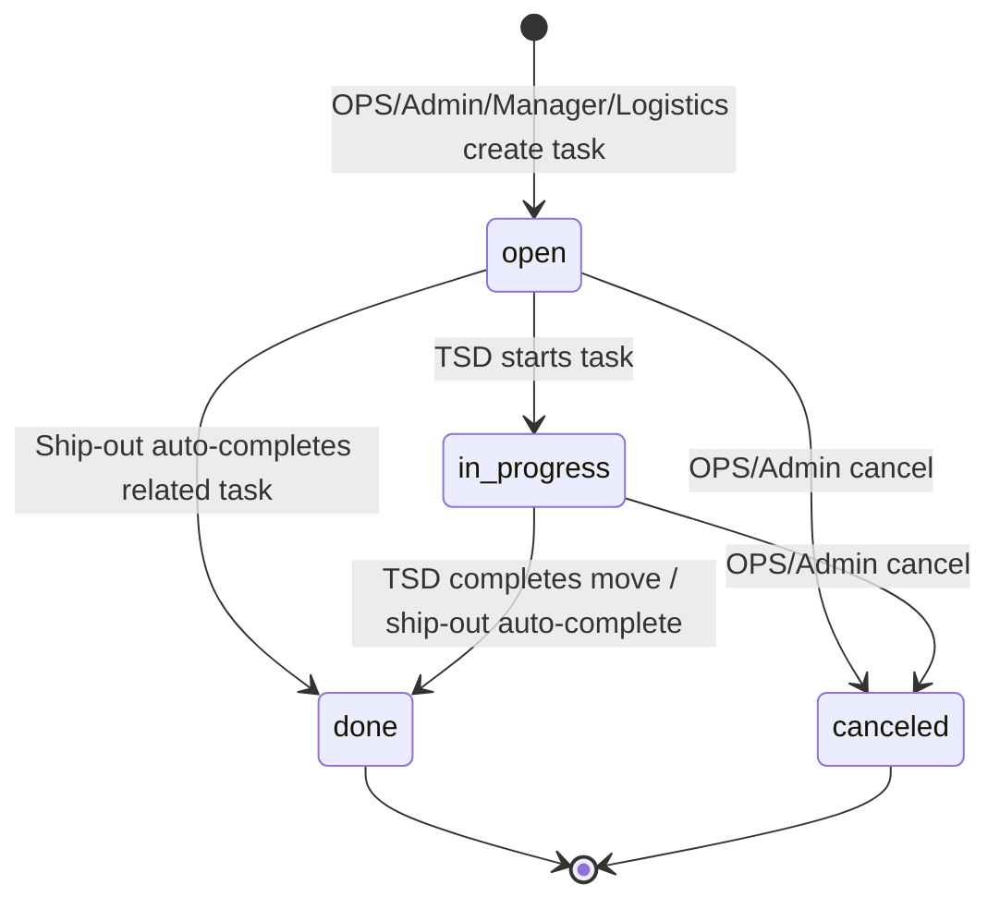

# Warehouse Process Contract

This folder defines the source-of-truth process contract for critical warehouse flows.

## Scope (current working process)

- Move unit by direct API (`/api/units/move`)
- Move unit by scan flow (`/api/units/move-by-scan`)
- Ship unit out (`/api/logistics/ship-out`)
- Cancel picking task with rollback (`/api/picking-tasks/[id]/cancel`)
- Return from `out` back to `bin` via move API

## Related Documents

- `docs/process/invariants.md`
- `docs/process/test-matrix.md`
- `docs/process/pr-checklist.md`
- `docs/process/working-agreement.md`
- `docs/process/quality-report.md`

## How to use

- Treat invariants as non-negotiable business rules.
- Update sequence/state diagrams when behavior changes.
- Add or update tests for every changed invariant.

## Sequences

### 1) Move Unit (`/api/units/move`)

### 2) Move by Scan (`/api/units/move-by-scan`)

### 3) Ship Out (`/api/logistics/ship-out`)

### 4) Cancel Picking Task (`/api/picking-tasks/[id]/cancel`)

### 5) Return from OUT to BIN

## Unit Status State Diagram

## Picking Task State Diagram

